# Настройка Compute

_Посмотрите обучающее видео на_ [_YouTube_](https://youtu.be/YFgXMpQszpM)_._

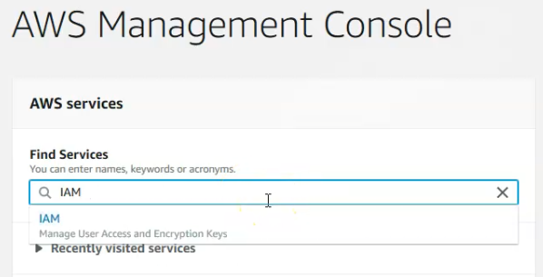

\(0:24\) Начните с домашней страницы консоли управления AWS.  
Чтобы получить доступ к панели управления учетной записью IAM, используйте строку поиска, либо выпадающее меню \(0:30\)

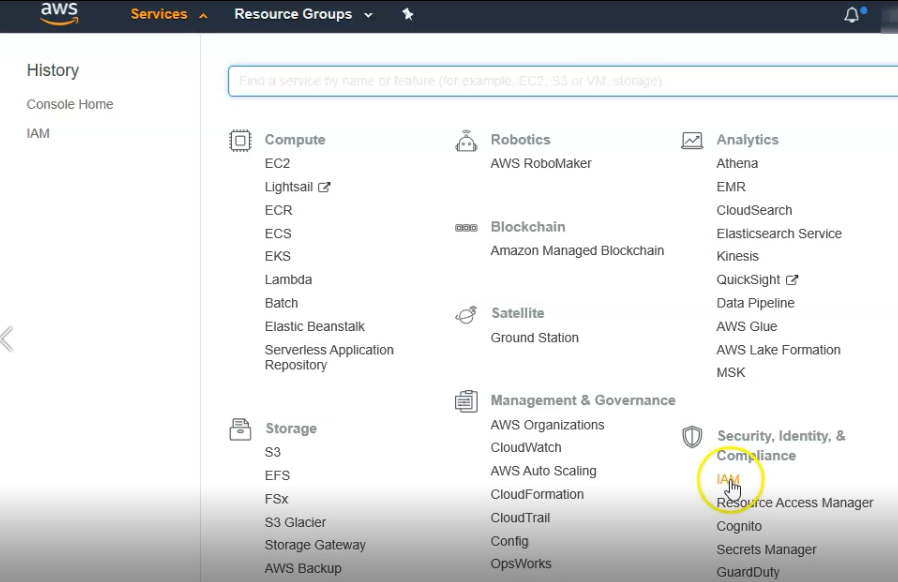

и нажмите на ссылку. 

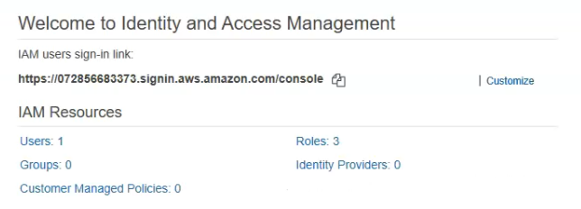

\(0:36\) 

Нажмите Users и далее - Add user. \(0:40\)

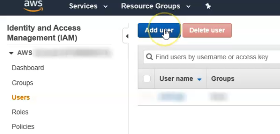

Задайте имя новому пользователю – в моем случае numerai\_train. В разделе Access type выберите Programming access, далее нажмите Next \(0:50\) 

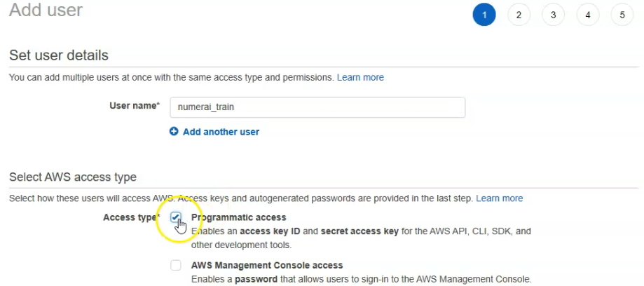

Далее нажмите attach existing policies directly и выберите первую строку, чтобы разрешить доступ администратору. Нажмите Next \(0:58\)

Вам не нужно добавлять теги, поэтому снова нажмите Next. Ещё раз нажмите на кнопку – новый пользователь создан. На странице будет отображен ваш открытый ключ и закрытый, приватный ключ. Я собираюсь скачать CSV, где я также могу сохранять мои ключи к API numerai \(1:08\)

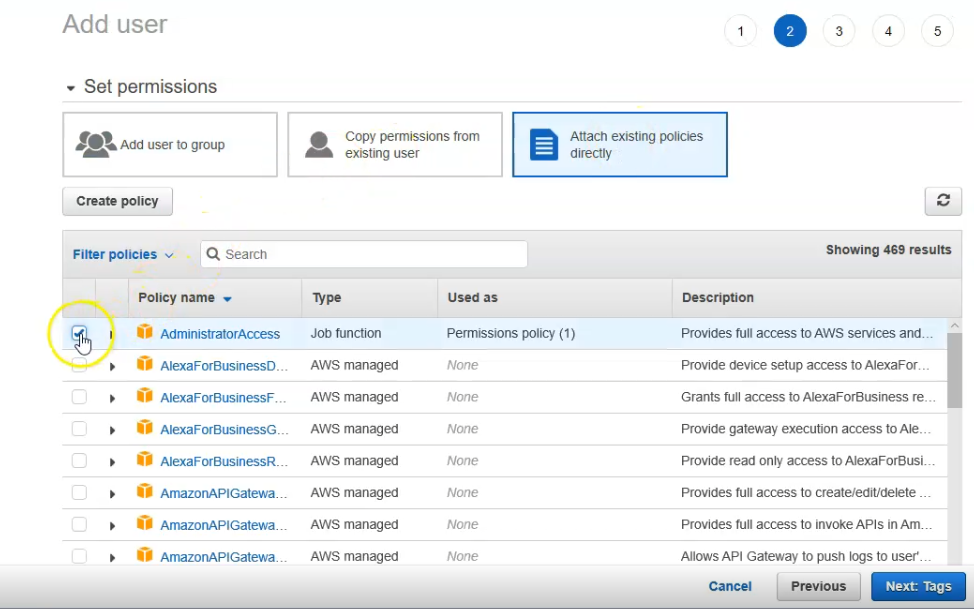

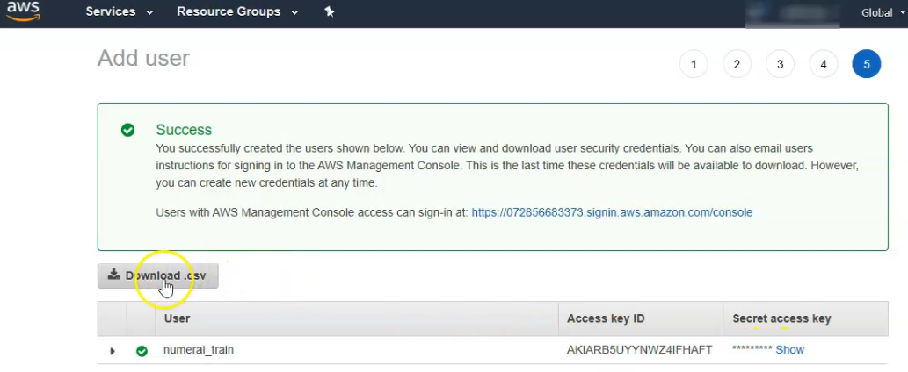

Далее откройте страницу настроек аккаунта numerai и нажмите Add. \(1:31\) 

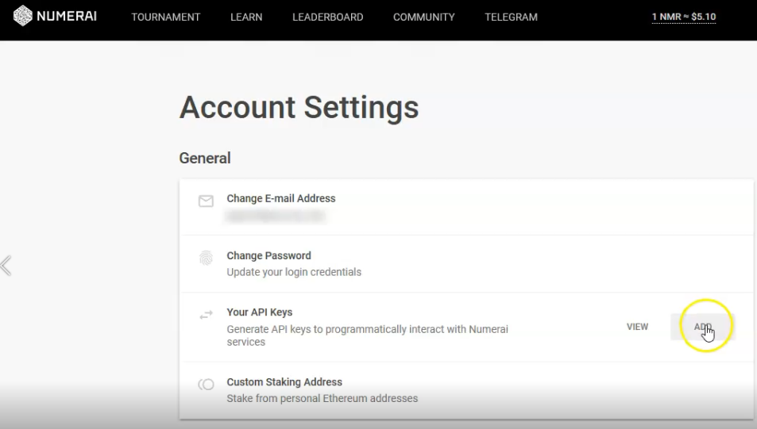

Задайте имя ключа и выберите следующие пункты: “upload submissions”, “make stakes”, “view historical submission info” и “view user info”. Введите пароль и нажмите generate key. \(1:48\) 

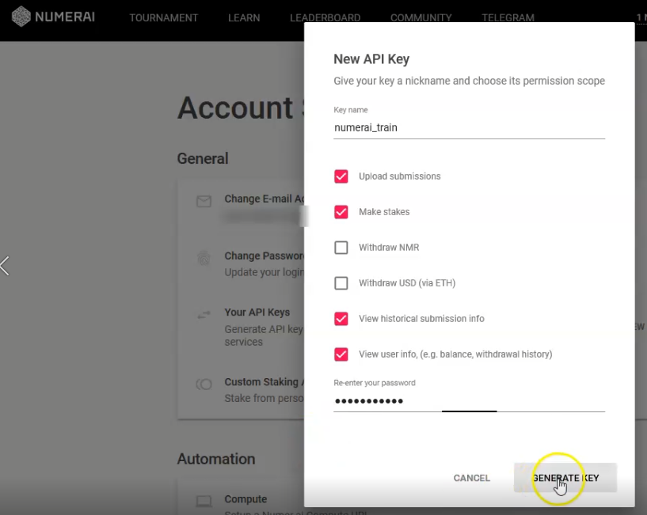

Скопируйте секретный ключ, который появится во всплывающем окне в левом нижнем углу. \(1:53\) 

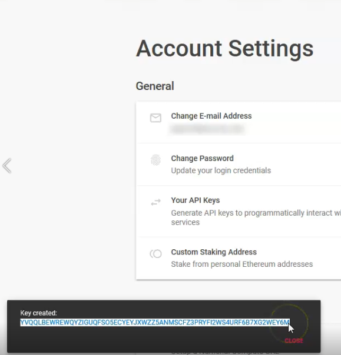

Вы можете сохранить этот ключ в CSV, скачанном из AWS. Также скопируйте открытый ключ \(2:04\)

_**Примечание: ключ доступа и секретный ключ позволяют управлять вашими аккаунтами AWS и Numerai. Держите их в безопасности, как имена пользователей и пароли!**_

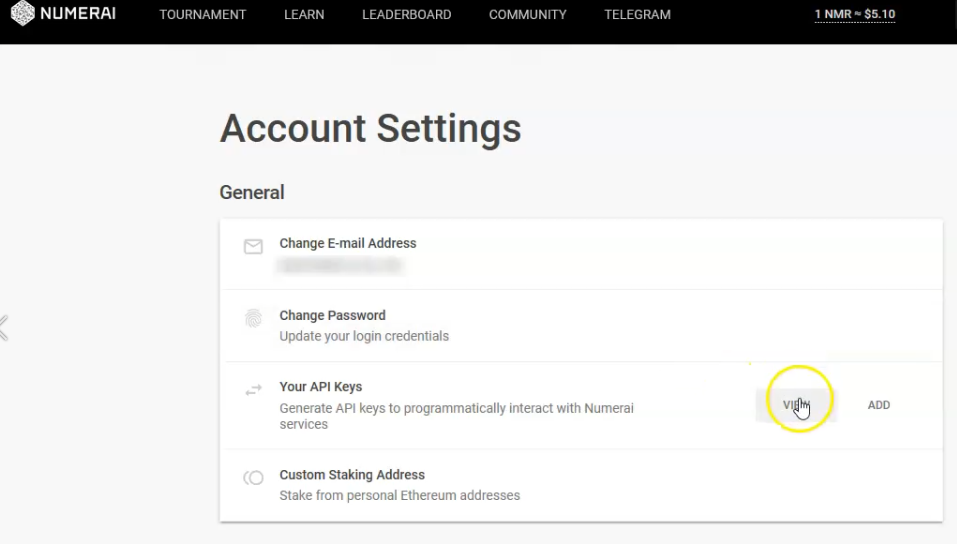

Сохраните открытый ключ в CSV. Далее откройте anaconda prompt и введите:  
_****_`pip3 install numerai_cli`   
\(2:23\) 

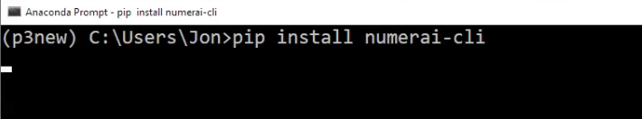

После установки введите:  
`mkdir example-numerai  
cd example-numerai  
numerai setup`  
\(2:42\) 

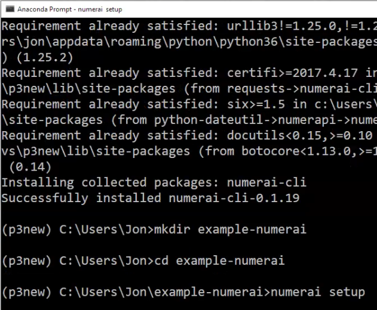

Теперь скопируйте и вставьте ключи, как указано в командной строке. \(3:15\)

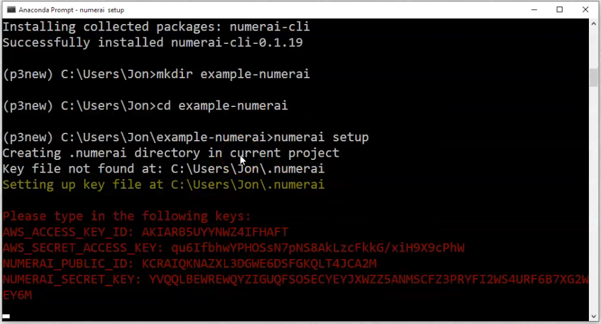

Перед вами должен отобразиться длинный список сообщений, что означает, что вы успешно установили numerai-cli. \(3:41\)

Введите:  
`numerai docker copy-example`  
Это даст нам все необходимые имена файлов и пример кода, который можно перезаписать. \(3:56\)

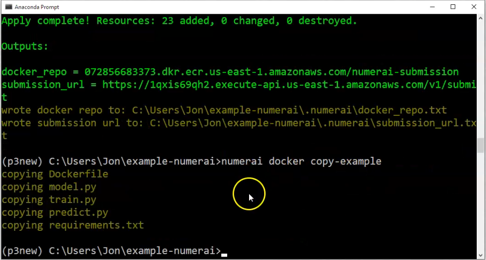

Теперь я собираюсь запустить очень простую регрессионную модель, используя RidgeCV из scikit-learn. Мы сохраним эту модель с помощью joblib. Введите:  
`numerai docker train`  
Докер запускает файл train.py, который загружает данные, обучает модель и сохраняет модель посредством joblib. Опустим процесс загрузки данных и обучения модели и пойдем дальше. Как видите, файл joblib сохранился в папке example\_numerai вместе с набором данных numerai. \(4:28\)

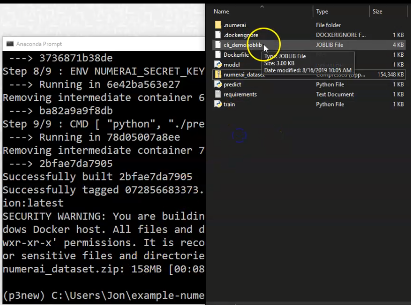

Перед тем как развёртывать Docker-образ в AWS, нужно убедиться, что модель работает корректно. Введите:  
`numerai docker run`  
Будет создан Docker-образ и запущен predict.py на вашем компьютере. Когда ваша модель завершит генерацию прогнозов, numerox загрузит ваши прогнозы, используя предоставленные вами ключи API. \(4:51\)

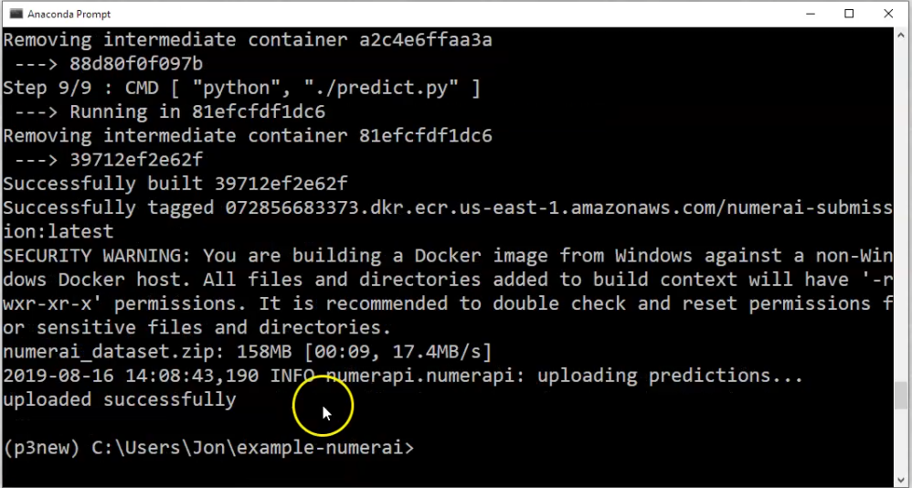

Давайте скопируем адрес вебхука. Перейдите в папку .numerai в папке example\_predictions. \(4:59\)

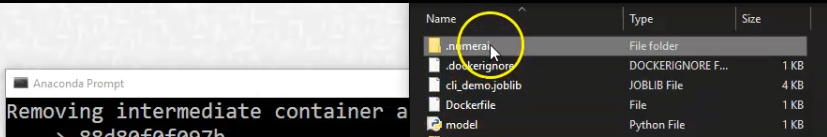

Откройте файл submit\_url.txt и скопируйте адрес. \(5:03\)

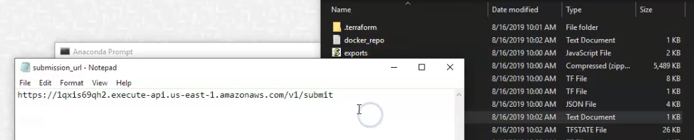

Снова откройте настройки аккаунта numerai, нажмите Compute, вставьте адрес в поле и нажмите change webhooks. \(5:15\) 

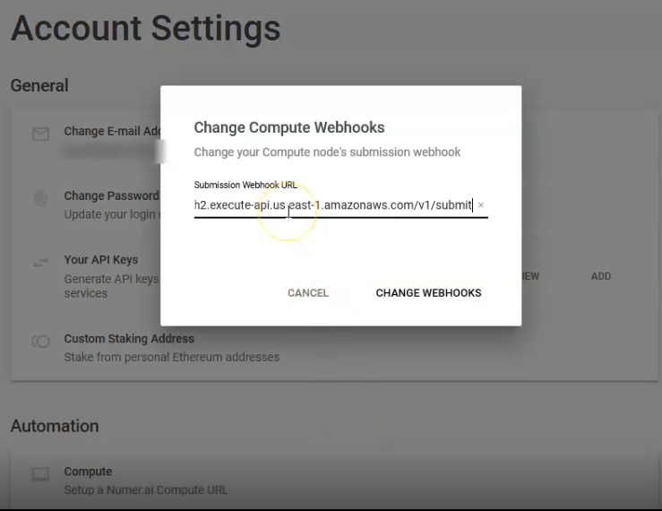

Как видите, строка last submission показывает, что внутренний тест прошел успешно. \(5:23\) 

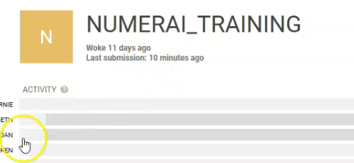

Введите `numerai docker deploy` и дождитесь отправления ваших Docker-файлов в AWS. \(5:48\)

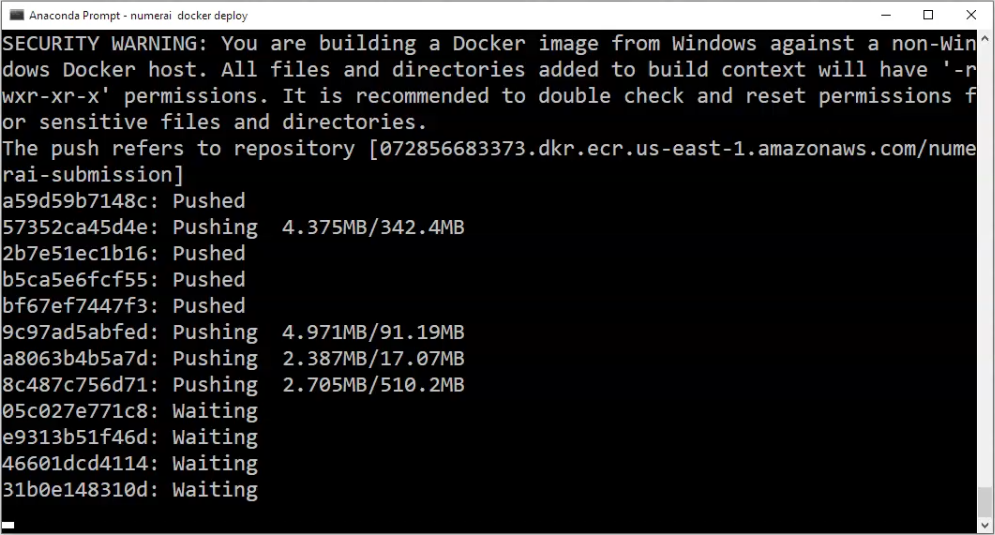

Проверьте вебхук, введя `numerai compute test-webhook`. Можно получить логи, введя `numerai compute logs -f`.

Когда появится сообщение `Task is now in the DEPROVISIONING state`, ваш код завершен. \(6:37\) 

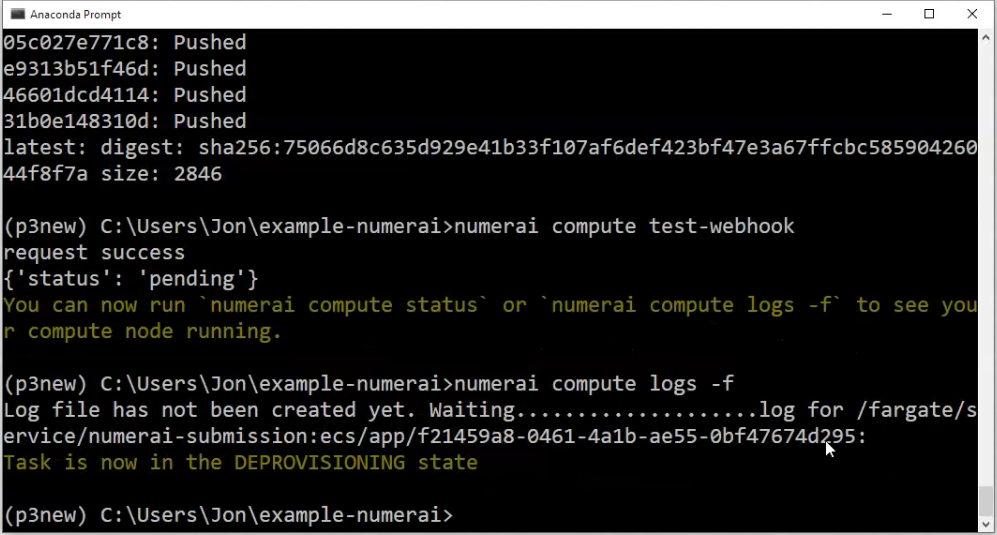

_Поздравляю, теперь вы можете спокойно наслаждаться субботами!_

