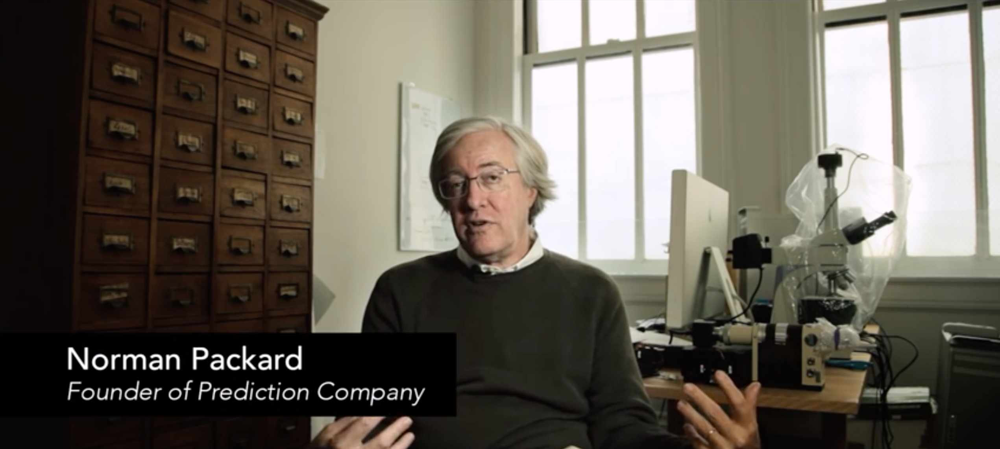

# Читать, смотреть, слушать

Numerai решила проблему совместного использования секретных финансовых данных путем их интеллектуального шифрования и свободного распространения. Numerai синтезирует искусственный интеллект для управления капиталом американского хедж-фонда. В этом короткометражном фильме мы объясняем, как это устроено.&#x20;

Интервью с [Говардом Морганом](https://en.wikipedia.org/wiki/Howard\_L.\_Morgan) (соучредителем Renaissance Technologies), [Норманом Паккардом](https://en.wikipedia.org/wiki/Norman\_Packard) (соучредителем Prediction Company), [Питером Диамандисом](https://en.wikipedia.org/wiki/Peter\_Diamandis) (основателем XPRIZE, Singularity University), [Олафом Карлсоном-Ви](https://www.crunchbase.com/person/olaf-carlson-wee#section-overview) (основателем Polychain Capital, ранее Coinbase), [Джои Кругом](https://www.crunchbase.com/person/joey-krug) (основателем Augur, Thiel Fellow, Pantera) и другими.&#x20;

[Смотреть фильм о построении метамодели Numerai](https://www.youtube.com/watch?v=dhJnt0N497c\&t=5s)

## Medium

[Encrypted data for efficient markets](https://medium.com/numerai/encrypted-data-for-efficient-markets-fffbe9743ba8) - Ричард Крейб, январь 2016 г.

[Rogue machine intelligence and a new kind of hedge fund, by Richard Craib](https://medium.com/numerai/rogue-machine-intelligence-and-a-new-kind-of-hedge-fund-7b208deec5f0) - Ричард Крейб, июль 2016 г.&#x20;

[Super intelligence for the stock market](https://medium.com/numerai/invisible-super-intelligence-for-the-stock-market-3c64b57b244c) - Ричард Крейб, август 2016 г.

## Пресса

Wired: [7,500 faceless coders paid in Bitcoin built a hedge fund's brain](https://www.wired.com/2016/12/7500-faceless-coders-paid-bitcoin-built-hedge-funds-brain/)

Financial Times: [Artificial intelligence-focused Numerai raises $1.5m](https://www.ft.com/content/b743fa8e-034a-11e6-af1d-c47326021344)

## Подкасты

[Unchained](http://unchainedpodcast.co/numerais-richard-craib-on-how-to-crowdsource-good-predictions-ep89), с Лорой Шин \
[Invest Like the Best](http://investorfieldguide.com/numerai/) с Патриком О'Шонесси\
[Decentralize This](https://open.spotify.com/episode/0rMlz4RkOqYPBVk4hFdNw5?si=oFzik9dNTMWdirzmyvmdzg) с Тор Байр \
[Zero Knowledge](https://www.zeroknowledge.fm/47) с Фредриком Гарриссоном и Анной Роуз\
[TWiStartups](https://thisweekinstartups.com/richard-craib-numerai/) с Джейсоном Калаканисом\
[Epicenter](https://epicenter.tv/episode/191/)
