# Использование Uniswap

Ссылка на видео: [https://www.youtube.com/watch?v=q4462zibrec](https://www.youtube.com/watch?v=q4462zibrec) 

Эта инструкция предполагает, что вы уже знаете, как получить Ether и установили Metamask. Следуя этой инструкции, вы поймете, как обменивать Ether на Numeraire с помощью Uniswap, а также переводить Numeraire в ваш кошелек аккаунта Numerai, чтобы использовать их для ставок. 

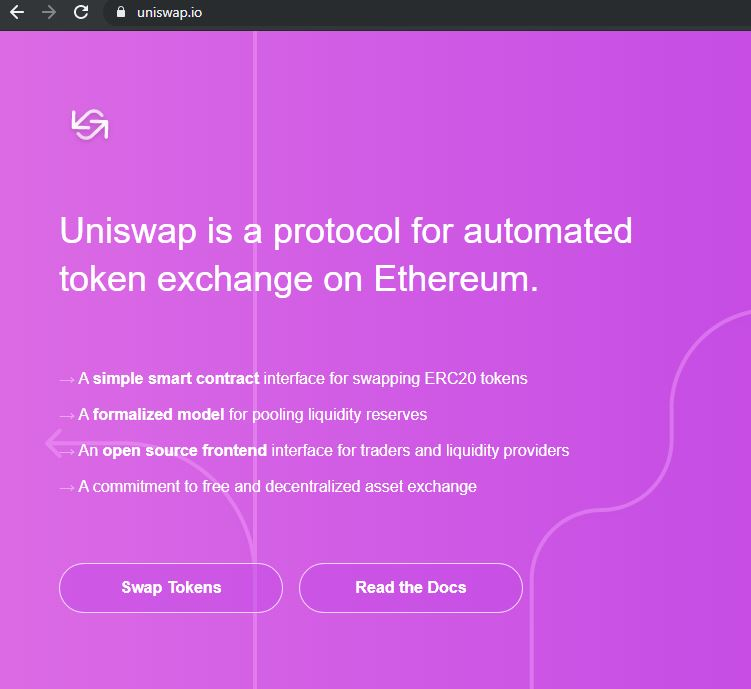

Для начала зайдите на [Uniswap](https://uniswap.io/) и ознакомьтесь с документацией. Uniswap - это протокол для автоматического обмена токенами стандарта ERC20. Для взаимодействия со смарт-контрактом, осуществляющим обмен, вы используете metamask.

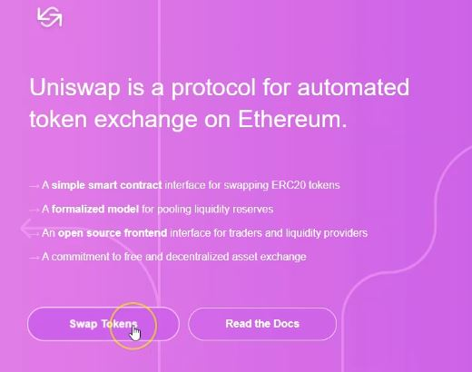

\(0:39\) Нажмите Swap Tokens, чтобы начать.

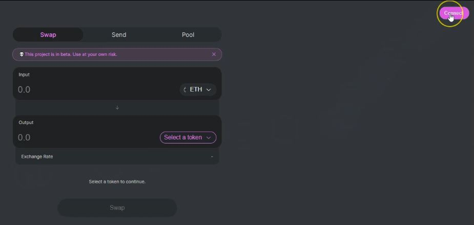

\(0:44\) Нажмите "Connect".

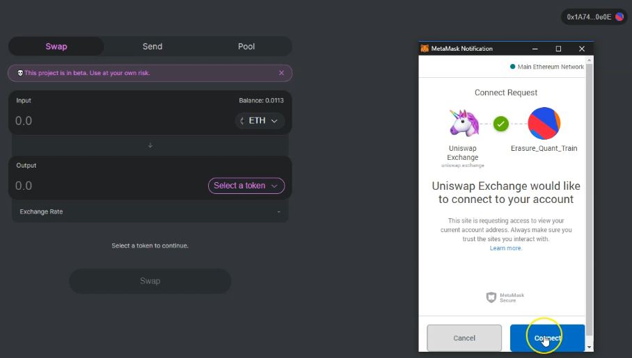

\(0:58\) Далее нажмите "Connect" в MetaMask.

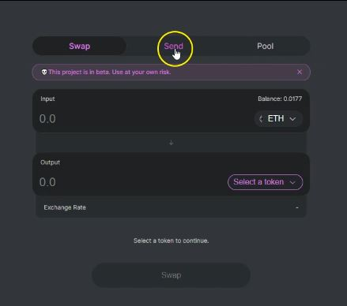

\(1:08\) Нажмите "Send".

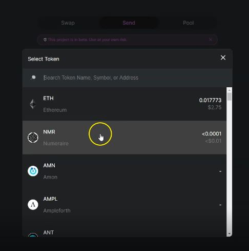

\(1:16\) Нажмите select a token и прокрутите вниз к Numeraire.

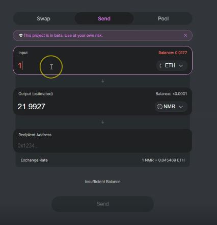

\(1:27\) В качестве теста в поле ввода наберите 1. В правом верхнем углу этой ячейки отображается фактический баланс, в ячейке вывода - приблизительное количество Numeraire, которое вы получите. Ниже представлен курс обмена.

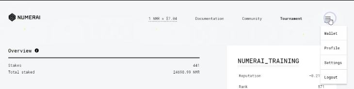

\(1:50\) Нам необходимо получить адрес нашего счета Numerai. Посетите веб-сайт турнира и нажмите на выпадающее меню в правом верхнем углу, далее нажмите "Wallet".

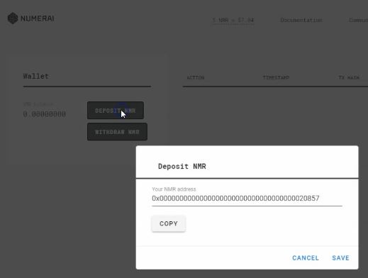

\(1:56\) Нажмите "Deposit NMR" и далее "Copy", чтобы скопировать NMR-адрес в буфер обмена.

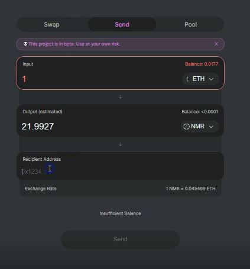

\(2:04\) Вернитесь на страницу Uniswap и вставьте адрес из своего аккаунта в поле "Recipient Address".

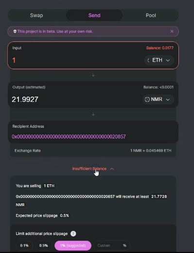

\(2:15\) Нажмите на расширение для просмотра подробной информации. Здесь вы сможете более детально ознакомиться с информацией о курсе обмена, а также увидеть ориентировочное проскальзывание цены. Чем больше заявка, тем больше проскальзывание – учитывайте это, планируя обмен Ether на Numerarie. Вы можете установить лимит на дальнейшее проскальзывание и вам рекомендуется сделать это. Как правило, большинству пользователей достаточно 1%.

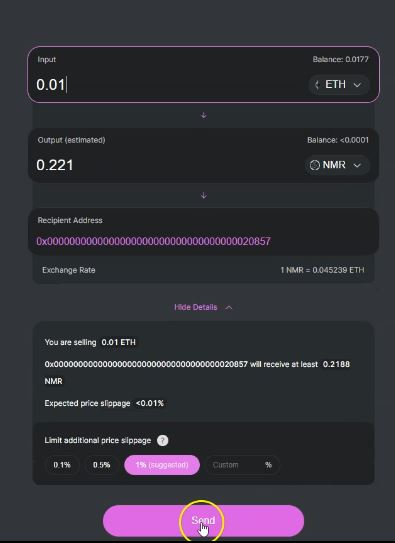

\(2:55\) Как только вы удовлетворены условиями обмена, нажмите "Send".

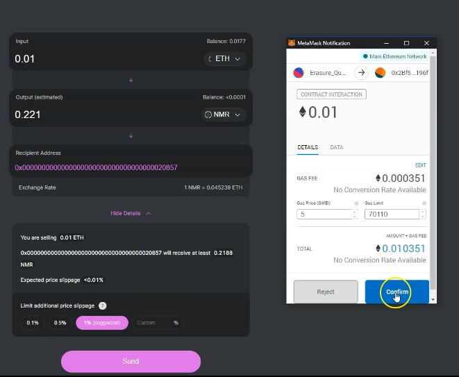

\(3:04\) Нажмите "Confirm" и дождитесь подтверждения транзакции.

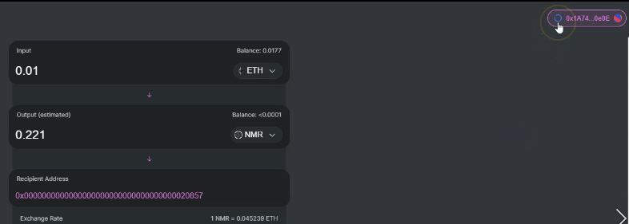

\(3:10\) MetaMask отобразит вращающийся круг в правом верхнем углу страницы Uniswap, что означает, что транзакция находится на рассмотрении.

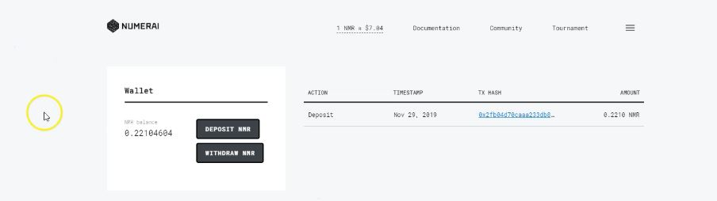

\(3:40\) Когда транзакция будет завершена, баланс вашего аккаунта на странице обновится. Вы также увидите обновление баланса на странице кошелька Numeraire.   
Вы успешно обменяли Ether на Numeraire!

Это всё, что нужно сделать, чтобы получить Numeraire. Конечно, существуют и другие способы, но этот метод наиболее простой. Ваша выгода может варьироваться, и вам следует провести свою собственную оценку перед тем, как осуществлять криптовалютный обмен с любой организацией -  криптографически или нет!

