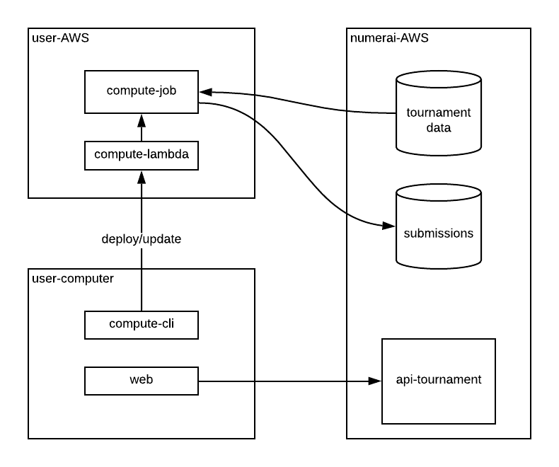

# Numerai Compute

## Введение 

**Compute** - это фреймворк, который помогает автоматизировать процесс представления прогнозов с помощью вашей собственной инфраструктуры. 

Используйте [numerai-cli](https://github.com/numerai/numerai-cli) для представления своей инфраструктуры, и разверните предварительно обученную модель в качестве сервера, который подхватывает новые данные турнира, запускает вашу модель и загружает прогнозы обратно в Numerai.



## Быстрый старт

```text
pip3 install numerai-cli

mkdir example-numerai
cd example-numerai

# set up your compute node in AWS
numerai setup

# copy a python example model
numerai docker copy-example

# build the docker container and deploys it to AWS
numerai docker deploy

# trigger your compute node in AWS
numerai compute test-webhook

# watch the logs of the running compute node from AWS
numerai compute logs -f
```

## Помощь

Следуйте нашей пошаговой [инструкции](https://docs.numer.ai/help/compute-tutorial) или посмотрите видео на [YouTube](https://www.youtube.com/watch?v=YFgXMpQszpM).

Обратитесь за помощью в [канал compute в rocketchat](https://community.numer.ai/channel/compute).

