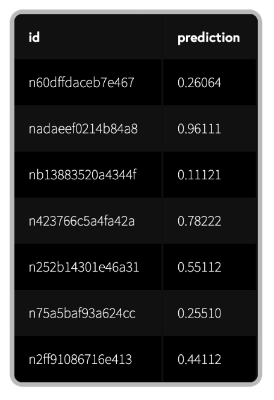
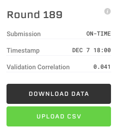
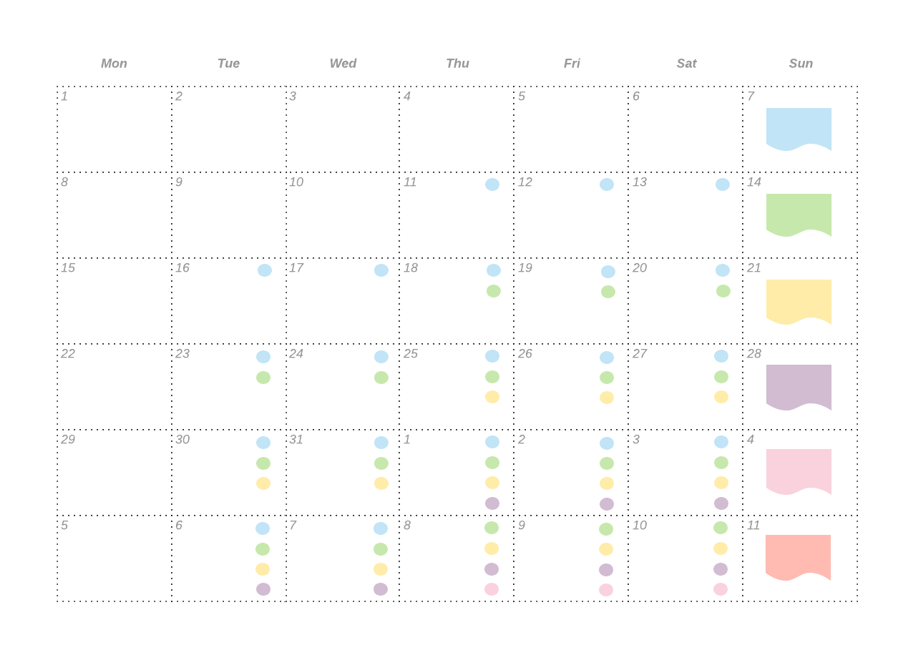
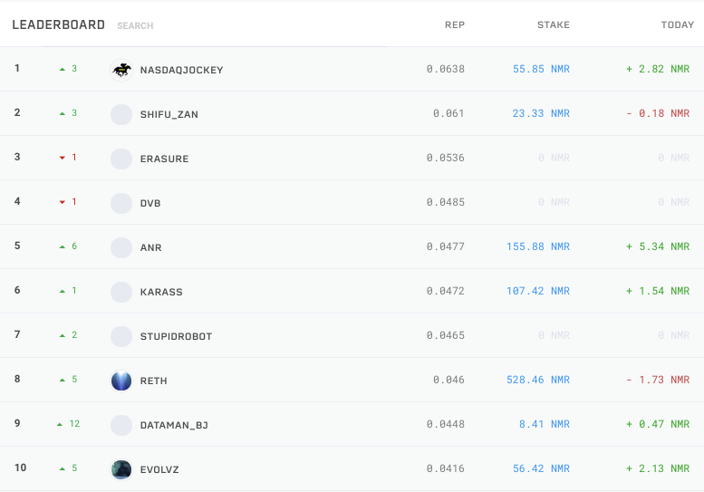

# Обзор турнира

## Введение

Numerai - это турнир по анализу данных, который поддерживает хедж-фонд Numerai. Чтобы иметь общее представление о том, как это работает, посмотрите [видео о метамодели](https://www.youtube.com/watch?v=dhJnt0N497c).

Долгосрочная цель Numerai - управлять всеми денежными средствами в мире посредством децентрализованной сети автономных интеллектуальных агентов. Подробнее читайте в нашем [генеральном плане](https://medium.com/numerai/numerais-master-plan-1a00f133dba9).&#x20;

Этот документ представляет собой краткий обзор структуры и правил турнира. Если вы новичок, начните отсюда!

## Данные

Для хороших прогнозов нужны хорошие данные. Но найти финансовые данные в состоянии эксплуатационной готовности нелегко. Хедж-фонды тратят миллионы на приобретение и управление этими данными и поэтому хранят их в секрете.&#x20;

Numerai предоставляет финансовые данные промышленного уровня бесплатно. Наши данные зашифрованы ([обфусцированны](https://medium.com/numerai/encrypted-data-for-efficient-markets-fffbe9743ba8)), чтобы сохранить реальные активы и функции в тайне, сохраняя при этом базовую структуру.&#x20;

Наши тренировочные данные (`training_data`) выглядят следующим образом. Каждый идентификатор (`id`) представляет актив с некоторыми абстрактными характеристиками\
(`features`), а каждая эпоха(`era`) – единичный период времени в истории. Цель (`target`) это абстрактный показатель производительности.


## Моделирование

Ваша задача - обучить модель делать прогнозы для данных турнира (`tournament_data`), не содержащих образец цели. Этот набор данных включает проверочную (`validation`) и тестовую (`test`) выборки, а также живые (`live`) показатели фондового рынка на данный момент.&#x20;

Ниже показана базовая модель-пример (`example_model`).

```python
import pandas as pd
from xgboost import XGBRegressor

# training data contains features and targets
training_data = pd.read_csv("numerai_training_data.csv").set_index("id")

# tournament data contains features only
tournament_data = pd.read_csv("numerai_tournament_data.csv").set_index("id")
feature_names = [f for f in training_data.columns if "feature" in f]

# train a model to make predictions on tournament data
model = XGBRegressor(max_depth=5, learning_rate=0.01, \
                     n_estimators=2000, colsample_bytree=0.1)
model.fit(training_data[feature_names], training_data["target"])

# submit predictions to numer.ai
predictions = model.predict(tournament_data[feature_names])
predictions.to_csv("predictions.csv")
```

Чтобы помочь вам начать, мы также написали две подробные инструкции по проблеме на [Python](https://github.com/numerai/example-scripts/blob/master/analysis\_and\_tips.ipynb) и [R](https://github.com/numerai/example-scripts/blob/master/example\_model.r). Эти инструкции охватывают такие ключевые понятия, как значимость признаков, перекрестная проверка, согласованность, переобучение и использование эр (`eras`). Независимо от того, являетесь ли вы новичком или опытным специалистом по обработке данных, мы настоятельно рекомендуем вам ознакомиться с этой информацией!&#x20;

Если вы хотите узнать больше о том, почему мы пошли таким путём, рекомендуем ознакомиться с книгой [Advances in Financial Machine Learning](https://www.amazon.com/Advances-Financial-Machine-Learning-Marcos/dp/1119482089) нашего научного консультанта[ Маркоса Лопеса де Прадо](https://www.linkedin.com/in/lopezdeprado/).

## Представления (submissions)

Каждую субботу публикуются новые `tournament_data`, и начинается новый раунд. Для участия в раунде, прогоните новые `tournament_data` через вашу модель и представьте свои прогнозы в Numerai.&#x20;

Файлы-представления выглядят следующим образом. Столбец `id` должен точно совпадать с таким-же столбцом в `tournament_data`. `prediction` может быть любым вещественным числом между 0 и 1 (исключая 0 и 1).&#x20;



Вы можете загрузить свои представления в любое время до открытия следующего раунда. Тем не менее, вовремя представленными считаются только представления, отправленные до 14:30 UTC (17:30 по Москве) понедельника. Поздние представления не учитываются при подсчёте оценочного балла и не имеют право на выплаты и бонусы.&#x20;



Вы можете загрузить свое представление через наш [веб-сайт](https://numer.ai/) или [api](https://api-tournament.numer.ai/). Вы также можете использовать клиентские библиотеки на [Python](https://github.com/uuazed/numerapi) и [R](https://github.com/Omni-Analytics-Group/Rnumerai), чтобы сделать это программно.

Опытным пользователям рекомендуем ознакомиться с [Numerai Compute](https://docs.numer.ai/tournament/compute) – платформой, которая помогает автоматизировать процесс представления.

## Оценка

Numerai измеряет эффективность на основе `rank_correlation` между вашими прогнозами и реальными целями.&#x20;



```python
# method='first' breaks ties based on order in array
ranked_predictions = predictions.rank(pct=True, method="first")
correlation = np.corrcoef(labels, ranked_predictions)[0, 1]
```



Каждый торговый день (в течение 4 недель) представление получает обновленную оценку корреляции, которая показывает насколько хорошо оно справляется с задачей.&#x20;

Если вы загружаете новые представления каждую неделю, вы получите перекрывающиеся оценки по нескольким представлениям, как показано ниже. Обратите внимание, что по воскресеньям и понедельникам оценка не производится. Эти пропуски соответствуют выходным, когда рынки закрыты.



Ниже показано как сработала модель-пример (`example_model`) в течение 10 недель. Каждая цветная линия представляет корреляцию для отдельных представлений. Обратите внимание на их колебания.


Мы объединяем эти перекрывающиеся оценки в единую, непрерывную оценку, беря ежедневное предельное изменение корреляции для каждого представления и вычисляя среднее изменение по всем перекрывающимся представлениям в данный момент. Мы называем это `average_daily_correlation`, и это основной оценочный балл, на котором базируются все выплаты и бонусы.&#x20;

Ниже приведен график суточных предельных изменений корреляции, обозначенных цветными точками, и `average_daily_correlation`, обозначенной плотным черным цветом.


## Ставка

Вы можете сделать ставку (`stake`) на свою модель , чтобы начать зарабатывать ежедневные выплаты.

Ставки вынуждают вас запереть NMR в специальном смарт-контракте Erasure. Это позволяет Numerai сжигать вашу ставку при плохой эффективности. Это ещё называют "шкурный интерес"  или "риск собственной шкурой" ([skin in the game](https://en.wikipedia.org/wiki/Skin\_in\_the\_game\_\(phrase\))).&#x20;


Ваша ежедневная выплата зависит от величины ставки ( `stake_value` ) и `average_daily_correlation`. Например, если `stake_value` составляет 100 NMR, а `average_daily_correlation` равна 0,1, ваша выплата составит +50%, и вы заработаете 50 NMR. Если `average_daily_correlation` равна -0,1, выплата составит -50%, и вы потеряете 50 NMR.&#x20;

Выплаты производятся каждый день, когда обновляются оценки, а кривая выплат применяется к каждой оценке `average_daily_correlation` отдельно. Все выплаты зачисляются на баланс вашей ставки, но не влияют на `stake_value`, используемую для расчета выплаты до следующего четверга. Например, выплаты, рассчитанные с 11 по 17 число, используют изначальную `stake_value`, равную 100, но с 18 числа и до следующей команды в качестве `stake_value` будет использоваться значение 150.&#x20;


Вы можете создавать и менять свою ставку на [веб-сайте](http://numer.ai/) или непосредственно [в блокчейне Ethereum](https://github.com/numerai/tournament-contracts). Ниже приведен пример размещения ставок на сайте.


Вы можете увеличить свою ставку в любой момент, и изменение вступит в силу в следующий четверг. Аналогично с уменьшением, за исключением того, что этот процесс всегда занимает дополнительно 4 недели.&#x20;

В начале каждого четверга отбирается до `100 000 NMR` в ставках, которые будут иметь право на выплаты. Если общая сумма ставок превышает это значение, все ставки будут выбраны пропорционально.&#x20;

Если у вас еще нет NMR, вы можете приобрести их на открытом рынке. Самый простой способ - через [ETH](https://coinmarketcap.com/currencies/ethereum/) на [Uniswap](https://uniswap.exchange/swap) или через [BTC](https://coinmarketcap.com/currencies/bitcoin/) на [Changelly](https://changelly.com/), [Upbit](https://upbit.com/exchange?code=CRIX.UPBIT.BTC-NMR), [Bittrex](https://bittrex.com/Market/Index?MarketName=BTC-NMR), [Poloniex](https://poloniex.com/exchange#btc\_nmr) и HitBTC.

## Таблица лидеров

Сохраняя высокую `average_daily_correlation` в течение продолжительного времени, вы зарабатываете место в таблице лидеров и получаете большой ежедневный бонус.



Ваш рейтинг (`rank`) в таблице лидеров зависит от вашей репутации (`reputation`), которая представляет собой сумму вашей `average_daily_correlation` за последние 100 дней.

Дни, в которых отсутствует балл `average_daily_correlation`, будут получать -0,005. Мы называем такой штрафной балл - `average_daily_correlation_penalized` и используем его для расчета репутации. Это значит, что новый пользователь начинает с репутации -0,5. Также это значит, что если вы отправляли представления еженедельно, чтобы получить штрафной балл, вам нужно пропустить 4 представления подряд.

Ваш бонус зависит от вашего ранга среди всех участвующих в ставках моделей (`staked_rank`) и вашей `stake_value` в начале 100-дневного окна. Например, если ваша `stake_value` составляла 100 NMR в начале окна, а ваш `staked_rank` равен 1, вы получите бонус в размере 5 NMR.&#x20;

Как и выплаты, бонусы зачисляются на баланс вашей ставки. Максимальная сумма бонуса, выплачиваемого в день, составляет `250 NMR` для всех моделей. Если общая сумма бонусов превышает это значение, то все бонусы выплачиваются пропорционально.

| Staked Rank | Ежедневный бонус |
| ----------- | ---------------- |
| Top 1       | 5%               |
| Top 10      | 4%               |
| Top 25      | 3%               |
| Top 100     | 2%               |
| Top 300     | 0.5%             |

Мы оставляем за собой право вернуть вашу ставку и аннулировать все выигрыши и проигрыши, если мы считаем, что вы активно злоупотребляете или нарушаете правила выплат.

## Поддержка

Нужна помощь? За ответами, поддержкой и обратной связью заходите в [rocket chat](https://community.numer.ai/)!
